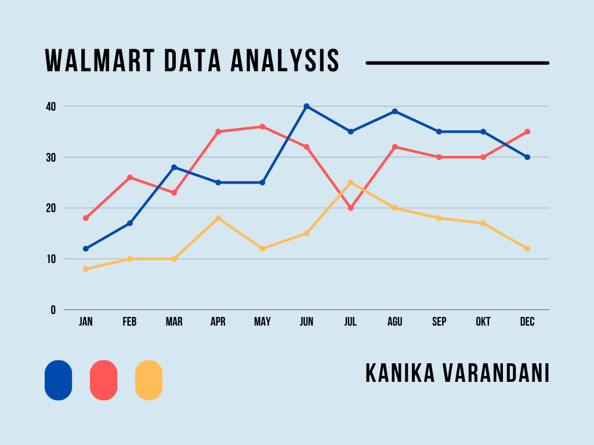

# Walmart Sales Analysis

Howdy there! Welcome to the Walmart Sales Data Analysis Project – where numbers meet narrative and insights come to life! I'm thrilled to have you here, ready to dive into the juicy details of my deep dive into the retail world of Walmart.

Project at a Glance:
---------------------
Alrighty, buckle up! This project ain't your run-of-the-mill analysis. No sir! It's a rollercoaster ride through Wally World's sales data, guided by yours truly, armed with a trusty spreadsheet and an insatiable curiosity. Together, we're about to unravel the mysteries of consumer behavior and retail trends.

What's Cookin', Good Lookin'?
------------------------------
Me, knee-deep in data, slicing and dicing those numbers like a seasoned chef prepping ingredients for the perfect dish. And boy, did we cook up some tantalizing findings! From the prime time for shopping frenzies to the surprising dominance of female shoppers in driving those sales figures sky-high, every graph and chart tells a story worth its weight in gold.

Graphs That'll Make You Go "Wow!"
-----------------------------------
Now, let's talk about the real stars of the show – my beautiful graphs! These aren't your grandma's bar charts; oh no, they're sleek, and packed with insights that'll make your jaw drop. Feast your eyes on the dazzling visualizations that bring the data to life, painting a vivid picture of Walmart's retail landscape like never before.

The 'Eureka!' Moments:
------------------------
Ah, those moments of pure revelation! You know the ones I'm talking about – when the pieces of the puzzle finally click into place, and you're left staring at your screen in awe. From uncovering the power of e-wallet payments to deciphering the intricate dance between weather patterns and consumer behavior, each 'Eureka!' moment was a victory worth celebrating.

My Analysis Report:
--------------------
Now, I'm not one to toot my own horn (okay, maybe just a little), but my analysis report is a masterpiece in its own right. It's not just a bunch of fancy words; it's a testament to the countless hours spent crunching numbers, crafting narratives, and uncovering insights that have the potential to reshape the retail landscape as we know it.

What's Next?
-------------
So, what's on the horizon, you ask? Well, my friend, the adventure is far from over! With my analysis report nestled snugly in the repository, it's time to take these insights and turn them into action. Whether it's optimizing marketing strategies, fine-tuning product offerings, or revolutionizing the checkout experience, the possibilities are endless – and I can't wait to see where this journey takes us next!

So, there you have it – the Walmart Sales Data Analysis Project, brought to you by yours truly. Get ready to be inspired, entertained, and maybe even a little bit surprised. After all, when it comes to data analysis, anything is possible – and with me at the helm, you can bet it's gonna be one heck of a ride!

Keep on crunching those numbers, my friends – the world is your oyster, and the data is your playground!

Cheers,
Kay
